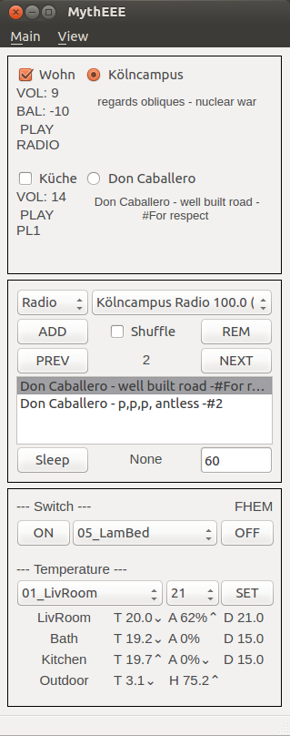

MythEEE
-------
My tiny house electronic & entertainment empire.

Lightweight `PyQT4`_ based universal graphical user interface to manage your household electronic
controls as well as your sound systems in Linux.

The demo configuration is prepared by the core interface as follows:
 - Control your `Sonos speakers`_ via the `CoSoCoW`_ (`SoCo`_) library.
 - Request your `FHEM`_ server via the `CoFhemIf`_ library to control your electronic components like room heating thermostat, switched socket-outlets or temperature sensors.

Installation and Usage
----------------------
Add the tool folder to your python library search path and check that all
dependent libraries are available.

Check that the interface configuration (mytheee2core.py) matches to your household components.

Enable the main modules with the parameters:
 - __b_cosocow_ena__ = True
 - __b_cofhemif_ena__ = True

Python compatibility tested with version 2.7 and 3.5.

Execute in linux terminal:

    $ python mytheee.py

Licence
-------
MythEEE is released under the `GNU GPL v3`_ license.

Demo Image
----------

.. _Sonos speakers: http://www.sonos.com/system/
.. _FHEM: https://fhem.de/
.. _SoCo: http://docs.python-soco.com
.. _CoSoCoW: https://github.com/tkdc/CoSoCoW
.. _CoFhemIf: https://github.com/tkdc/CoFhemIf
.. _GNU GPL v3: https://www.gnu.org/licenses/gpl.html
.. _PyQT4: https://riverbankcomputing.com/software/pyqt/intro
